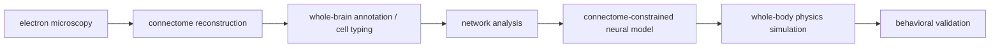

# 果蝇大脑上传：Connectome 到 Embodied Simulation

## Meta
- type: `deepresearch`
- domain: `research`
- spark: `on`
- created: 2026-04-06
- source: KG/raw/legacy-notes/果蝇大脑上传：Connectome 到 Embodied Simulation.md

## Content
# 果蝇大脑上传：Connectome 到 Embodied Simulation

## 关联笔记

- Drosophila Connectome Brain Upload Papers
- 果蝇上传大脑：执行摘要与研究路线
- Transformer-Brain intepretability
- Top AI Company Research

## 关键词

- `connectome`
- `brain upload`
- `embodied simulation`
- `locomotion control`
- `Loihi 2`

> [!abstract]
> 这里的“果蝇大脑上传”并不是完整意义上的心智上传，而是把果蝇 connectome 约束下的神经回路，逐步变成可执行的计算图，再接到 whole-body physics simulation 上，看它能否重现真实行为。

## 这个 object 的核心判断

- 当前最接近“brain upload”的，不是上传主观意识，而是上传 `结构约束 + 回路动力学 + 身体耦合`。
- 果蝇是目前最适合做这条验证链路的动物之一，因为它已经拥有完整 adult brain connectome。
- 对 AGI 真正有价值的，不是“复制果蝇”本身，而是 `connectome-constrained architecture`、稀疏图拓扑、模块化控制回路、以及具身验证方法。

## 当前 pipeline

## 关键事实

- `adult whole brain`: 139,255 neurons
- `synapses`: about 50 million
- `2024 Nature trilogy`: whole-brain statistics + annotation + wiring diagram
- `closest executable step`: connectome graph -> locomotion controller / neuromorphic simulation
- `missing layer`: long-timescale plasticity, neuromodulation, internal state, and memory continuity

## 研究结构

### 1. 数据层：先把脑“完整地画出来”

- `whole-brain connectome`: `01` `02` `03`
- `baseline`: `04` hemibrain, `05` larval whole-brain connectome
- 这一步解决的是 `brain as structure`，不是 `brain as dynamics`

### 2. 网络层：从 wiring 走向 function

- `06` 说明 brain topology 不是装饰，而是功能约束
- `07` 说明 connectome 不是静态蓝图，而会在发育过程中重写
- 这一步开始把 `graph statistics` 变成 `functional prior`

### 3. 可执行层：把 connectome 变成会跑的模型

- `08` 把 whole-brain connectome 转成 graph model，用于 whole-body locomotion control
- `09` 把 whole-brain connectome 放到 Loihi 2 上，验证 neuromorphic deployment 的可行性
- `10` 用 connectome simulation 识别 fly walking 的 central pattern generator circuit

### 4. 具身层：脑必须接上身体

- `11` 提供 whole-body physics simulation，补齐 behavior validation 的身体层
- 没有 body，connectome 最多只能证明结构；接上 body 后，才有可能验证 control policy

## 为什么这件事对 AGI 有意义

- `topology matters`: 连接结构本身可能就是强先验，不一定要靠纯 dense MLP 学出来
- `modularity matters`: connectome 天然提供模块边界、瓶颈、hub、rich-club 等结构约束
- `embodiment matters`: 可执行智能最终要在 body / environment loop 中验证，而不是只在静态 benchmark 上验证
- `interpretability matters`: 如果 architecture 直接继承 connectome 结构，可解释性会比黑箱 dense net 更强

## 现在还没做到什么

- 还没有实现完整意义上的 `mind upload`
- 还没有把长期记忆、内部状态、可塑性、激素 / 神经调质系统可靠并入
- 还没有证明 connectome 本身足以恢复完整行为 repertoire
- 现在更准确的说法是：`brain upload pipeline for executable control`, not `full subjective upload`

## 入口

- 论文清单与本地 PDF
- 长摘要与研究路线
- 本地 ZIP 包

## Keypoints
<!-- LLM 提取，每条是一个可连接的知识点 -->
<!-- 如果该 keypoint 在其他 node 也出现过，标注 (also in: node名) -->
- [[KP - Memory|Memory]]
- [[KP - 果蝇大脑上传|果蝇大脑上传]]
- [[KP - Loihi 2|Loihi 2]]
- [[KP - connectome|connectome]]
- [[KP - brain upload|brain upload]]
- [[KP - locomotion control|locomotion control]]
## Links
### hints

### dive-ins
