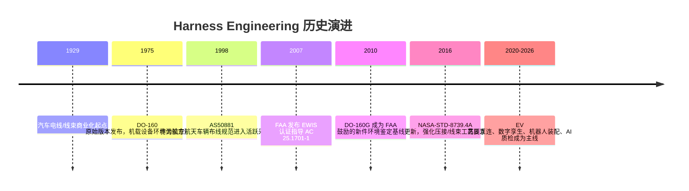

# Harness Engineering 综合评述

## 执行摘要

Harness Engineering（线束工程）不是单一的“电线打包”工作，而是一门跨越系统架构、电气连接定义、拓扑与空间布置、三维路由、制造工艺规划、试验验证、质量管理和服役维护的系统工程学科。按 entity["organization","NASA","us space agency"] 的定义，线束是“由一根或多根绝缘导线/电缆组成、带有两个或以上电气端接器件、可作为一个整体装配和处理的组件”；而离散电缆组件则更强调“定义长度、作为单元进行互连”的属性。现代线束工程的核心，不再只是“连接”，而是以可制造、可验证、可追溯、可维护的方式管理复杂互连系统的全生命周期。citeturn17view2turn16view1turn24search16turn22view2

如果不限定具体行业，线束工程最强的共性矛盾有四个。第一，复杂度持续上升：电动化、ADAS、连接化和软件定义产品让线束的重量、束径、连接器数量、变型数量和变更频率同步上升；公开白皮书甚至给出“接近 40 套线束、约 700 个连接器、3000 多根导线、总长超 4 km、重量约 60 kg”的现代汽车级量级。第二，制造仍高度依赖人工：公开资料显示，线束制造总体上约 85% 的作业仍为手工完成，而汽车高压线束制造的增值活动中，手工作业占比也可高达约 85%。第三，质量风险分布广：失效并不只来自导通中断，还包括压接高阻、端子退针、绝缘磨损与电弧跟踪、连接器微动腐蚀、温振耦合疲劳、EMC 串扰、密封失效与环境侵蚀。第四，标准体系碎片化但不可替代：IPC/WHMA、ISO、IEC、SAE/USCAR、航空 EWIS/DO-160、NASA 工艺标准、汽车质量体系和行业客户特定要求共同构成合规框架。citeturn35view3turn22view0turn31view0turn18view0turn38view1turn38view2turn16view5turn16view4

过去十年最重要的变化，不是某一根“更好的线”，而是工具链和工程方法的迁移。主流平台已经把逻辑电气设计、拓扑定义、三维装配集成、展平/Formboard、制造文档、成本估算、产线仿真和数字孪生逐步连成闭环；与此同时，机器人装配、计算机视觉、合成数据、触觉/视触觉学习、数字孪生监控和高压互连技术都在快速推进。但从公开论文来看，线束自动化距离“全流程、量产、跨变型”仍有距离：2025 年一项双臂多分支线束自动装配研究在两个复杂场景中的成功率仍分别为 55% 和 73%，这说明工程价值巨大，但也说明问题本质仍然困难。citeturn22view1turn22view2turn9view2turn28view0turn31view3turn32search0

对工程师的首要建议是：把线束视为“数据主导的产品系统”，而不是“制造车间里的后置产物”；尽早把逻辑连接、拓扑、空间约束、DFM/DFS、试验矩阵和变更管理纳入同一数字主线。对研究者的首要建议是：聚焦“可认证的 AI、可量产的自动化、可回收材料与连接方案、可闭环的数字孪生”，而不是只在简化实验中追求局部最优。对管理者的首要建议是：优先投资能减少人工重录、缩短 ECN 落地时间、增强追溯与质控的能力，因为这类能力通常比单点设备采购更快转化为成本、质量和交付收益。上述判断由当前公开的标准、原始论文和工业白皮书共同支持。citeturn22view0turn22view3turn31view0turn31view1turn25search7turn34search1

## 定义、范围与历史演进

在线束工程语境中，“线束”与“电缆组件”相关但不完全相同。NASA 工艺标准把 harness 定义为：带有分支、护套或编织层、并配置两个及以上端接器件、可作为一个整体装配与处理的导线/电缆总成；而 MSFC 的图样标准则将 cable assembly 描述为：具有定义长度、至少一处分支端接、作为离散单元安装，用于设备间互连的装配件。对工程实践而言，这一差别意味着：线束工程既处理“连接正确”，也处理“装得进去、做得出来、测得到、修得动”。由于本报告的行业焦点未被预先限定，下文采用跨行业分析框架，并在汽车、航空航天/航电和工业设备场景下强调差异化要求。citeturn17view2turn16view1

从范围上看，线束工程至少包括七个层次：需求与接口定义、回路/原理图设计、拓扑与安装空间规划、三维路由与封装、展平/工艺板（formboard）生成、制造与质量策划、验证与服役维护。Zuken 的公开说明强调线束必须同时具备“逻辑表示”和“3D 物理表示”；Siemens 则把制造准备进一步扩展到 formboard、工艺规划、成本和制造文档；Dassault Systèmes 将三维线束设计直接关联到制造和图纸生成。也就是说，现代 Harness Engineering 的边界已经从“设计一套线”扩展为“管理一条数字线程”。citeturn24search16turn24search1turn22view2turn23view1

下图给出一条高置信度的历史演进主线：早期以汽车电线束商业化为起点，中期以航空环境适航与安装标准化为特征，近十余年则转向 EV 高压互连、数字孪生和机器人自动化。其作用不是给出唯一历史叙事，而是帮助理解“为什么今天的线束工程同时是电气、机械、制造、质量和数据问题”。citeturn26search2turn16view5turn39view3turn38view2turn16view6turn5search18turn21view0turn22view1turn9view2

公开历史节点也说明了一个重要事实：线束工程的演进并不是简单的“材料升级”，而是由安全监管、系统复杂度和制造组织方式共同推动。尤其在航空航天中，EWIS 被明确纳入适航与持续适航体系；在汽车中，复杂功能堆栈和高压系统把线束从低关注部件推向关键系统集成元件。citeturn38view2turn16view6turn35view3turn21view0

## 核心概念、应用场景与行业价值

线束工程最容易被忽略的，是“表示层”的切换。逻辑层关注回路、信号、电源、端子分配和连接关系；拓扑层把逻辑连接投射到安装空间、路径和分支结构；物理层则处理三维路由、束径、最小弯曲半径、夹具、固定点、护套、密封和装配约束；制造层进一步把三维结果展平为 formboard 或工艺图，用于人工或自动装配。Zuken 明确指出 topology 是把逻辑设计带入物理世界，能够自动计算段径、重量和成本；Siemens 和 Zuken 也都把 formboard 定义为“一比一、全尺寸”的制造性表示。citeturn24search1turn24search0turn24search2turn24search12

一组常用术语可以将这一层级关系说清楚。**breakout** 是导线从主束体中分离出的分支；**shield** 是包覆一个或多个导体的金属屏蔽层；**drain wire** 是沿箔屏蔽敷设、用于与屏蔽层导通的引流线；**strain relief** 是使机械应力不直接施加到端接部位的结构；**contact retention** 则是端子在壳体内不被轴向拉脱的保持能力；**flattening/formboard** 是将三维线束转化为二维制造表示。NASA、IEC、Zuken 和 Siemens 的公开文档共同说明，线束工程的关键不是“知道有哪些零件”，而是知道这些概念在不同表示层如何保持一致。citeturn17view2turn18view2turn15search7turn24search12turn22view2

在线束的行业应用上，汽车与航空航天最典型，但绝非全部。公开产品与行业页面显示，线束/线缆系统广泛服务于汽车、电动化、高压互连、航空航天、工业设备、家电、轨道交通和更广义的高可靠电子互连场景。线束之所以跨行业通用，是因为它把分散导线组织成可安装、可防护、可测试的系统，从而同时改善装配效率、耐久性与安全性。只不过，汽车更强调成本、产量和变型；航空航天/航电更强调 EWIS、环境鉴定和布线隔离；工业设备则更强调可维护性、EMC 和工厂布线集成。citeturn13search1turn25search4turn6search3turn16view5turn39view3

image_group{"layout":"carousel","aspect_ratio":"16:9","query":["automotive wire harness formboard assembly","aircraft wiring harness bundle connector backshell","EV high voltage cable harness orange connector","wire harness manufacturing automated crimping machine"],"num_per_query":1}

从价值链角度看，线束的工程价值远高于其表面材料。Yazaki 对汽车线束的描述很直接：线束负责可靠地把车辆中的电气电子设备“连接”起来，承担供电、信号和信息传输。Aptiv 的架构白皮书则进一步指出，每增加一项功能，通常都要增加相应线束、连接器和 ECU 互连，从而带来重量、空间和复杂度压力。因此，线束工程既是“功能落地”的末端，也是“系统复杂度暴露”的前线。citeturn6search2turn21view2

## 设计方法学、工具链与数字化

现代线束设计方法学的主线可以概括为：**需求与接口定义 → 原理/连接定义 → 拓扑与安装空间 → 三维路由 → 展平与制造化 → 工艺/成本/文档 → 仿真验证 → 变更闭环**。如果这一链路被拆散，由不同团队在不同文件中人工转录，错误会成倍增加。Siemens 的白皮书明确指出，线束设计与制造部门之间长期存在数据碎片化，很多流程仍依赖 Office 和 AutoCAD 图纸手工重录；Altium 的白皮书则强调，传统的分离式电/机流程和人工制图已经难以承受现代项目的复杂度与频繁变更。citeturn22view0turn22view3

对工具链的正确理解，不是“哪家软件最好”，而是“哪类工具覆盖哪一层表示，以及如何把数据贯通”。下表基于主要厂商公开页面整理，反映的是公开能力与典型定位，不是第三方基准测试。citeturn23view0turn23view1turn23view2turn23view3turn23view4turn23view5turn23view6turn22view2

| 工具链层 | 代表平台 | 公开能力摘要 | 更适合的场景 |
|---|---|---|---|
| 线束详细设计与制造协同 | Capital Harness Designer / Capital Manufacturing | 规则驱动、可验证、制造就绪设计；支持 formboard、工艺规划、制造文档、成本与数字孪生 | 大型企业、强制造协同、跨工厂变型管理 |
| MCAD 深度集成的 3D 线束设计 | CATIA Electrical / Harness 系列 | 3D 线束设计直接进入制造与图纸生成，机械封装与安装强 | 航空航天、复杂装备、以机械集成为核心的组织 |
| 拓扑—物理—制造一体化 ECAD | E3.topology / E3.cable / E3.formboard / E3.Harness Flattening | 逻辑、拓扑、物理与展平贯通，自动计算段径/重量/成本 | 车辆、交通装备、需要逻辑与物理同步的团队 |
| 中型团队/现代化 2D 线束设计 | Arcadia Harness | 从原理图到 2D 线束布局，降低手工工作量 | 中小团队、需要快速数字化的组织 |
| 多物理场 CAE | Simcenter 3D | 结构、疲劳、热、振动、电磁和多物理场耦合 | 需要系统级 CAE 与 PLM 贯通的企业 |
| EMC 分析 | CST Studio Suite / Ansys EMC Plus | 适合做线束电磁兼容、雷击/耦合、混合电磁求解 | 航空航天、汽车高压/高速互连、EMI 风险高的系统 |
| 电缆电热与参数化建模 | COMSOL Multiphysics | 适合电热耦合、载流热、绝缘和环境耦合问题 | 高压电缆、热管理、研究型团队 |

在方法层面，至少有五条成熟原则。其一，**逻辑与物理分离但必须同步**，否则变更无法闭环。其二，**尽早引入重量、成本、束径和空间的 trade-off study**，而不是把这些问题留到机械校核后返工。其三，**把展平及 formboard 视为设计输出而不是车间二次创作**。其四，**将仿真前移**，尤其是热、电磁、振动、弯折与维护可达性。其五，**为制造自动化而设计**，例如统一端子/壳体几何、减少非标准插装动作、为视觉和机器人抓取保留几何与标识特征。citeturn35view3turn24search12turn24search10turn23view6turn34search1

数字化的下一步不是简单“上 PLM”，而是建立可执行的数字孪生。Siemens 公开说明中，线束数字孪生已经从“已验证产品模型”扩展到“数字化制造过程模型”和“生产数字孪生”，可在建线之前优化 formboard、工位分配、资源利用和瓶颈。最新的学术方向则开始把数字孪生用于航空线束机器人布线监控与异常管理。对研究者而言，这意味着数字孪生正在从“文档一致性工具”演化为“制造与质量推理工具”。citeturn22view1turn22view2turn32search0turn32search20

## 材料、部件与制造工艺

线束材料的选择，本质上是多目标折中：导电性、重量、柔性、耐温、耐液体、耐磨、阻燃、真空放气、EMC、装配性、可维修性和回收性之间很少能同时最优。IEC 60228 仍是导体横截面、线股结构和电阻等基础要求的重要基线；但到了具体行业，材料选择又会迅速转向场景化：汽车更关注成本、耐液体和自动化兼容；航空航天更强调耐温、放气、辐照与 EWIS 可靠性；高压电动化更强调触电防护、耐高温和大电流/高电压互连。citeturn20view5turn20view1turn20view0turn21view1

下表概括了常见导体与绝缘材料的工程取舍，依据为官方标准页、NASA 选型指南和厂商公开资料整理。citeturn20view5turn20view0turn20view2turn20view3turn35view0turn35view1turn35view3

| 材料/类别 | 主要优点 | 主要局限 | 典型场景 |
|---|---|---|---|
| 铜导体 | 高导电率、成熟的压接/端接生态、广泛标准化 | 重量高、铜价波动影响 BOM | 通用线束、低压/高可靠系统 |
| 镀锡铜 | 抗腐蚀、更易焊接、在潮湿/污染环境更稳健 | 成本略高于裸铜 | 潮湿环境、需要较好耐蚀性的互连 |
| 铝/铝合金导体 | 重量优势明显，适合降质量 | 直径通常需放大以维持导电能力；端子兼容、腐蚀控制和工艺窗口更难 | 汽车轻量化、部分高压/大截面应用 |
| PVC 绝缘/护套 | 成本低、用途广 | 温度与高端环境能力有限 | 家电、一般工业内部布线 |
| XLPE / 交联聚烯烃 | 较好的耐热性与薄壁应用基础 | 机械/耐油等能力依产品而异，回收难度通常高于热塑型材料 | 汽车内部布线、一般工业 |
| PTFE / FEP | 高温、阻燃、低吸湿、良好放气；PTFE 适合焊接，FEP 常作护套 | 冷流、FEP 抗切穿较弱、成本高、较重 | 航空航天、严苛环境、高温区域 |
| ETFE / 交联 ETFE | 机械强度、耐磨、耐低高温与流体能力好 | 某些场景下阻燃/氧环境适配需谨慎；交联后柔性与加工性下降 | 汽车发动机舱、航空航天、薄壁高性能导线 |

对“铜还是铝”的讨论，近十年明显升温。Aptiv 的公开材料给出一个相当激进的上限：铝线系统相对传统平均线束可带来最高约 48% 的质量下降潜力，但同时又明确指出，必须解决铝线与端子之间的电/化学稳定性问题，因此提出了选择性金属涂层（SMC）来抑制电偶腐蚀。Siemens 的白皮书则提醒，铝导体不仅需要更大的直径维持相同导电能力，还会遇到“不同端子供应商/合金体系不兼容”的工程问题。这意味着铝不是“直接替换铜”，而是“重构导体—端子—工艺—供应链”的系统决策。citeturn35view0turn35view1turn35view3

从部件角度看，线束的关键单元至少包括导体、绝缘、屏蔽层与引流线、端子/触点、连接器壳体、密封件、线夹/固定件、护套/波纹管、扎带/缠绕材料和背壳/应力释放件。NASA 标准中的 shield、drain wire、grommet、strain relief 等定义提醒我们：很多故障并不来自“导线本身”，而来自这些辅助件未能把机械、环境和电磁应力隔离掉。高压电动化中，TE Connectivity 的公开白皮书还把 touch-safe、可拆解诊断和回收友好性直接纳入高压连接系统目标。citeturn17view2turn21view1

制造工艺方面，线束行业并不存在单一最佳工艺，而是按复杂度、批量、端接类型和质量要求进行组合。下表概括常见工艺路线。citeturn25search0turn36view3turn36view4turn36view0turn37view0turn25search5turn25search14

| 工艺 | 主要优势 | 主要风险/局限 | 适用场景 |
|---|---|---|---|
| 人工 formboard 装配 | 适应高混流、多分支、频繁变更 | 劳动密集、质量依赖人员技能、追溯弱 | 航空航天、小批多样、复杂异形线束 |
| 自动切线/剥线/压接 | 处理速度高、重复性好、易追溯 | 夹治具与窗口设定要求高 | 中高批量的导线预制 |
| 自动穿壳/端子插入 | 降低插错、退针和节拍波动 | 受壳体几何与变型影响大 | 汽车、工业线束中等复杂度场景 |
| 压接（crimping） | 低成本、高质量、适合量产；是替代焊接的主流端接方式 | 受压接高度、端子材料、线股、镀层、设备状态强影响 | 绝大多数端子线束连接 |
| 焊接（soldering） | 对特定连接形式仍必要，理论上可获得低接触电阻 | 热损伤、应力集中、工艺一致性与培训要求高 | 航空航天/高可靠特定端接、返修 |
| 超声波焊/拼接 | 固相连接、无需焊料，可做线—线或线—端子连接 | 设备与工艺窗口专用性强 | 拼接、大截面、高压互连、部分铜/镀锡线场景 |
| 在线力/压接力监测及二次锁止 | 提高过程检出率、减少隐蔽缺陷 | 需要设备集成与数据治理 | 自动穿壳、压接和高压线束装配 |

压接工艺值得单独强调。Molex 的官方资料将 crimping 定义为：为减少焊接端接而发展出的、以相对低成本获得高质量端子—导线连接的工艺；其公开技术说明还指出，**crimp height** 是一种快速、无损的过程控制属性，用于确保端子对导体的正确“冶金压缩”。这反映出行业的真实做法：压接质量首先是一道过程控制问题，然后才是成品检验问题。citeturn36view0turn36view1

## 测试、验证、可靠性与标准体系

线束工程的验证体系，必须同时回答四个问题：**连接是否正确、绝缘是否足够、环境下是否可靠、组织过程是否可控**。单一标准无法覆盖全部问题，因此实际项目通常采用“工艺/接收标准 + 产品环境标准 + 行业质量体系 + 客户/项目附加规范”的叠加框架。IPC/WHMA-A-620 的官方页面明确指出，该标准是电缆与线束装配“要求与验收”的行业共识标准，覆盖材料、方法、试验以及压接、机械固定和焊接互连；ISO 16750 系列则定义道路车辆电气电子设备的环境应力与推荐试验，但明确说明 EMC 不在其覆盖范围内；航空航天侧则由 AS50881、EWIS 认证指导、DO-160 环境鉴定和 AS9100 质量体系等共同构成。citeturn16view4turn16view2turn39view3turn38view2turn16view5turn16view7

标准体系的重要性不仅在“验收阈值”，更在“职责分配”。AIAG 页面显示，IATF 16949:2016 定义了全球汽车行业组织的质量管理体系要求；IAQG 页面说明 9100:2016 是适用于航空、航天与防务组织的扩展型质量体系；NASA-STD-8739.3 则把培训、认证、视觉要求和受控工艺程序都写入可靠焊接连接的标准框架。这意味着高可靠线束质量并不只是末端检验，而是人员资格、程序控制、设备监控与记录可追溯的组合。citeturn39view0turn16view7turn37view0

下面是跨行业最常见的一组验证项目。实际项目的限值和样本量必须以适用标准、客户规范和产品图纸为准。citeturn17view1turn18view0turn18view2turn18view3turn20view4turn38view5

| 试验/检查 | 主要目的 | 常见依据 | 常见输出 |
|---|---|---|---|
| 连续性/点对点导通 | 发现开路、错线、短路、映射错误 | NASA-STD-8739.4A、各类 EOL 测试规程 | Netlist 正确性、导通矩阵 |
| 绝缘耐压（DWV/Hi-Pot） | 验证绝缘系统在规定电压下不击穿 | NASA-STD-8739.4A、产品规范 | 漏电流、击穿/飞弧与否 |
| 绝缘电阻（IR） | 评估绝缘泄漏与污染/损伤风险 | NASA-STD-8739.4A | MΩ/GΩ 级绝缘值 |
| 压接高度、截面与拉脱力 | 控制压接窗口，验证机械强度 | USCAR-21、UL/MIL、Molex 工艺 | 压接高度、微切片、最小拉力 |
| 插入力/拔出力/保持力 | 验证连接器与端子保持能力 | IEC 60512-13-2、15-2 | 力—位移、保持力、端子脱出风险 |
| 电流循环/温升 | 验证载流热应力与电接触稳定性 | IEC 60512-9-5、高压专规 | 温升、接触电阻漂移 |
| 热冲击/温湿循环/振动 | 验证环境服役可靠性 | ISO 16750、DO-160、HALT 方法 | 失效率、松动、微动磨损 |
| 阻燃/火焰传播 | 评估单线/单缆火焰传播 | IEC 60332-1-2 | 自熄、炭化长度 |
| EMC/耦合/雷击相关 | 评估串扰、敏感度、雷击耦合 | DO-160、EMC 专项仿真/试验 | 辐射/传导结果、耦合风险 |

NASA-STD-8739.4A 提供了一个很有代表性的最小接收测试顺序：**continuity → DWV → IR**。其公开条文给出，线束至少应做点对点连续性测试；DWV 可采用 1050±50 Vac 或 1500±75 Vdc（取连接器/线缆/导线数据表允许值中的较低者），泄漏电流不应超过 1 mA；绝缘电阻则以 500 Vdc 施加至读数稳定。这种顺序安排的逻辑，是先排除映射错误，再进行耐压，再做绝缘评估，以降低潜在过应力风险。citeturn17view1

可靠性上，最典型的失效路径包括：绝缘磨损/裂纹导致的电弧跟踪，连接器在热循环和振动下的微动腐蚀，压接几何不当引发的高接触电阻或机械脆弱性，以及温振耦合条件下的端子失效。FAA 的咨询通告明确指出，chafing、abrasion 或绝缘劣化可能导致裂纹与导体暴露，进一步引发 arc tracking；NASA 早期报告则强调，电弧跟踪可沿线束束体传播并导致整束失效；近年的连接器研究表明，振动模式会显著影响低压汽车连接器的失效率估计。可靠性验证因此必须从“电性能测试”扩展到“环境—结构—工艺耦合测试”。citeturn38view1turn38view3turn38view5

## 近十年进展、主要挑战与未来方向

近十年线束工程最清晰的研究主线，是从“经验工艺”走向“可计算、可感知、可优化的互连系统”。这条主线可以分成四个簇：机器人与协作自动化、视觉与 AI 质检、高压与轻量化互连、数字孪生与数据架构。代表性工作如下。citeturn30search0turn29search1turn31view3turn31view0turn9view3turn27view1turn28view0turn9view2turn32search0

过往十年中，汽车与航空航天都证明了自动化的价值，但也暴露了线束问题的独特本质：线束是 **deformable linear object**，具有分支、拓扑变化、遮挡、柔顺接触和高变型等特性，很难像刚体装配那样被完全标准化。2020 年的综述指出，汽车线束制造自动化之所以重要，是因为线束在电动化和自动驾驶背景下已经演化为安全关键系统；2022 年的协作机器人综述指出，现有研究更多证明了改善人体工学与提升潜在产能的可能性，却很少给出真正的成本—收益或节拍分析；2024—2025 年的研究则明显转向更具体的子问题：多分支检测、装配顺序规划、连接器插接策略优化、双臂自动装配与可重构编程。citeturn30search0turn29search4turn9view3turn27view1turn28view0turn9view2

工业白皮书与学术研究之间，已经出现了值得关注的耦合。工业侧，Siemens 把 focus 放在设计—制造数据断裂、数字孪生和 ramp-up 优化；Aptiv 把 focus 放在 EV 高压互连、架构简化和轻量化；TE Connectivity 同时推进高压触电防护、可拆解连接、自动化标准化和高压工装。学术侧，研究则集中在如何让这些工业目标具备“可自动执行”的基础能力，例如：分支识别、装配序列生成、柔性抓取、机器人插接、合成数据增强、数字孪生监控与知识图谱式工艺协同。真正的前沿，不是单篇论文或单个设备，而是这两条线路的收敛。citeturn22view1turn22view2turn21view0turn21view2turn34search1turn32search25

当前最关键的挑战可以归纳为以下几类。**第一，自动化难题并未解决本体问题。** 双臂装配系统虽已可覆盖多阶段任务，但在复杂真实场景中的成功率仍未达到传统刚体装配所需的工业鲁棒性。**第二，变型与变更管理仍是成本黑洞。** 公开白皮书显示，现代项目中的设计变更多、跨域不一致代价高。**第三，高压和轻量化带来新的连接难题。** 铝导体、不同端子材料体系、触电防护和长期耐久并不是局部优化能解决的。**第四，可靠性失效模式更加耦合。** 振动、湿热、污染、温升和微动磨损共同作用，导致传统“静态通断测试”不再充足。**第五，可持续性与可回收性尚未真正进入主设计约束。** 很多高性能绝缘体系与交联材料在回收端仍然棘手。citeturn9view2turn22view0turn35view3turn21view1turn38view1turn12search3

如果看未来五到十年，最值得关注的趋势有六个。其一，**AI 进入受约束的工程环境**：不是无限制黑盒，而是像 2025 年视触觉连接器插接研究那样，把模型用于“参数优化”和“安全可审计控制器”而非替代控制本体。其二，**自动化将更多采用人机协同和半自动化路径**，因为线束问题对柔性、人因和变型非常敏感。其三，**数字孪生会从产品模型扩展到制造质量与异常诊断**。其四，**高压互连将继续推动连接器、导体和工装一体化演进**。其五，**增材制造的近期成熟方向更可能是夹具、工装、连接器外形件和局部嵌线结构，而不是全面取代传统线束**。其六，**随着架构集中化/分区化推进，线束不会消失，但其拓扑、分布和模块边界会变化**。citeturn28view0turn31view1turn22view1turn32search0turn21view1turn10search20turn27view4turn21view2

## 成本、供应链、可持续性与建议

线束成本的第一驱动因素仍然是人工。Siemens 明确写道，线束制造“极度劳动密集”，约 85% 的操作仍由人工执行；Olbrich 与同事在高压线束研究中也指出，高压线束制造的增值活动中，人工占比可高达约 85%；USITC 的研究则把 wire harnesses 明确列为更适合在低工资国家生产的劳动密集型汽车零部件。这意味着，无论是汽车还是其他大批量产业，线束的直接材料成本并不是唯一主导项，工时、工装、变型切换、返工和物流往往同样关键。citeturn22view0turn31view0turn13search2

第二类成本驱动是结构复杂度本身。公开白皮书中，现代汽车量级的线束连接器数、线数、特殊电缆数、束径和空间约束都在上升，而这些量几乎直接映射到材料成本、装配节拍、错误率、测试矩阵和售后难度上。更重要的是，复杂度不是静态的；它还会通过频繁工程变更放大。Siemens 和 Altium 都强调，数据不连续会导致机械、电气、工艺和车间说明之间出现不一致，最终转化为延误和质量事故。换言之，线束工程的真实成本函数是“材料 + 劳动 + 变更 + 风险”，而不是“铜价 × 重量”。citeturn35view3turn22view3turn22view0

供应链上，线束是最典型的“看似低技术、实则脆弱”的部件之一。其脆弱性来自三个方面：劳动密集、跨区域布局明显；端子/壳体/材料体系存在专用性；很多工位仍依赖熟练工经验。2023 年关于自动布线工具的论文甚至提到，线缆预装经常在 best-cost countries 进行，而长供应链与韧性不足正在推动某些终装活动向高自动化国家回迁。对采购和运营团队来说，这意味着评估供应商不能只看单价，还要看工艺透明度、设备监控、ECN 响应速度、端子—导体兼容性数据库、客供标准遵循能力和地缘风险暴露。citeturn31view2turn13search17turn25search7

可持续性方面，线束正从“可拆下来的废料”变成“需要设计阶段介入的循环对象”。欧盟委员会关于 ELV（报废车辆）规则的公开说明强调，欧盟正在推动车辆拆解与回收更加环保，并自 2023 年起推进法规评估与新规提案；近期针对汽车线束的 LCA 研究则表明，采购与运输情景会显著影响环境表现，reshoring 与自动化可能带来改进。另一方面，回收并不轻松：研究显示，从废旧线束中同时高纯度回收铜和 PVC 是可行的，但交联聚烯烃（如 XLPE）的回收仍长期具有挑战，近期研究仍在探索可规模化路线。换句话说，线束的可持续性不是“回收端单独努力”能解决的，它需要导体、绝缘、连接方式和拆解策略共同设计。citeturn12search1turn12search0turn12search2turn12search3turn12search11

基于以上证据，对工程师和研究者可以提出几条较强的、可执行的建议。对工程师而言，优先级最高的是四件事：**把逻辑—拓扑—物理—制造数据打通；在方案期就量化重量/成本/束径/空间 trade-off；把压接窗口、插壳监测和 EOL 测试纳入统一追溯；为维修、诊断和回收预留可拆解接口。** TE 在高压连接白皮书中把易拆解与回收友好性直接纳入目标，Siemens 则把数字孪生前移到制造和 ramp-up，二者都表明“后端友好”必须在前端设计中落实。对研究者而言，最值得投入的方向是：**可认证 AI、柔性对象建模与抓取、面向产线的视觉/触觉融合、线束制造知识图谱与数字孪生闭环、可回收高性能绝缘与嵌线增材制造。** 这些方向同时回应了自动化、质量、韧性与循环性四类核心矛盾。citeturn21view1turn22view1turn22view2turn28view0turn31view3turn32search25turn27view4

### 开放问题与局限

本报告优先采用了原始论文、官方产品页面、标准机构页面和官方白皮书，但线束领域的重要标准中有相当一部分完整条文是授权销售文档，例如 IPC/WHMA-A-620、USCAR-21、IEC 60512 的若干分册以及部分 SAE/RTCA 文件。因此，本文对这些标准给出的适用范围、试验目标和高层要求的把握是高置信度的，但对具体条款细节、样本量、失效判据和某些行业专门阈值，项目实施时仍应直接以正式购置版本为准。另一个局限是：关于“大规模量产自动化”的公开论文虽然增长迅速，但很多结果仍停留在实验单元或有限复杂度场景，距离跨车型、跨工厂、跨供应链的稳健落地还有明显工程距离。citeturn16view4turn18view0turn18view2turn16view5turn9view2

### 参考文献

1. NASA-STD-8739.4A《Crimping, Interconnecting Cables, Harnesses, and Wiring》：线束定义、设计与验收测试。citeturn17view2turn17view1  
2. MSFC-STD-3631《Electrical Cable Harness Assembly Drawing Standard》：电缆组件/线束图样与制造测试数据要求。citeturn16view1  
3. Yazaki 官方历史资料：1929 年开始销售汽车电线/线束。citeturn26search2  
4. RTCA DO-160 页面与 FAA AC 21-16G：机载设备环境鉴定方法与 FAA 接受性。citeturn16view5turn16view6  
5. AS50881 / DLA Quick Search：航空航天车辆布线选择至安装的活跃规范。citeturn39view3  
6. IPC/WHMA-A-620 官方页面：线缆与线束装配“要求与验收”的行业共识标准。citeturn16view4  
7. ISO 16750-1:2018 预览：道路车辆电气电子设备环境条件与试验总则。citeturn16view2  
8. AIAG IATF 16949:2016 页面：汽车行业质量管理体系要求。citeturn39view0  
9. IAQG 9100:2016 页面：航空航天质量管理体系要求。citeturn16view7  
10. IEC 60512-13-2、15-2、9-5 页面：插拔力、保持力、电流循环等连接器测试。citeturn18view2turn15search7turn18view3  
11. IEC 60332-1-2:2025 页面：单根绝缘导线/电缆垂直火焰传播试验。citeturn20view4  
12. IEC 60228:2023 页面：电缆导体截面、结构和电阻基线。citeturn20view5  
13. Siemens Capital / 白皮书：线束设计—制造数字主线、数字孪生、人工占比与复杂度。citeturn22view0turn22view1turn22view2turn35view3  
14. Dassault Systèmes CATIA / CST 页面：3D 线束设计、制造图生成与电磁仿真。citeturn23view1turn23view5  
15. Zuken E3 系列页面：拓扑、线束、formboard 与 flattening。citeturn23view2turn24search1turn24search2turn24search12  
16. Cadonix Arcadia Harness 页面：原理图到 2D 线束布局。citeturn23view3  
17. Simcenter 3D / Ansys EMC Plus 页面：结构、热、电磁与线束 EMC 仿真。citeturn23view6turn23view4  
18. NASA NPSL 绝缘选择指南、TE 线缆资料、UL 758 页面：PTFE/FEP、ETFE、XLPE 等材料选择。citeturn20view0turn20view1turn20view2turn20view3  
19. Aptiv 与 Sumitomo Electric 关于铝线束/轻量化的资料。citeturn35view0turn35view1turn35view2  
20. Molex 压接技术与质量手册：压接高度、拉脱力、SPC 与压接工艺控制。citeturn36view0turn36view1turn36view2  
21. NASA-STD-8739.3《Soldered Electrical Connections》：可靠焊接连接、培训与资格要求。citeturn37view0  
22. FAA 咨询通告与 NASA 报告：绝缘磨损、电弧跟踪、EWIS 持续适航。citeturn38view1turn38view2turn38view3  
23. Nguyen, Kuhn, Franke 等：制造自动化、合成数据质检、多分支检测。citeturn30search0turn31view3turn9view3  
24. Zhou 等：线束装配序列图模型框架。citeturn27view1  
25. Kienle 等：基于视触觉学习的连接器自动插接。citeturn28view0  
26. Malvido Fresnillo 等：双臂多分支线束自动装配系统。citeturn9view2  
27. Navas-Reascos 等、Salunkhe 等：协作机器人与半自动化线束装配综述。citeturn29search4turn31view1  
28. Olbrich, Lackinger：汽车高压线束制造工艺、自动化障碍与研究缺口。citeturn31view0  
29. 欧盟委员会 ELV 页面与线束 LCA/回收研究：循环性、运输影响与材料回收挑战。citeturn12search1turn12search0turn12search2turn12search7  
30. Stratasys 与嵌线增材制造研究：夹具增材制造与嵌入式导体的未来潜力。citeturn10search20turn27view4